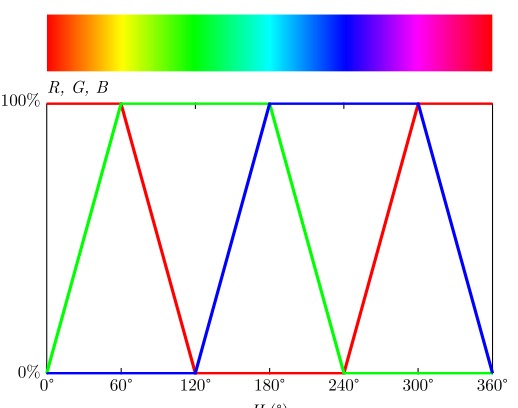
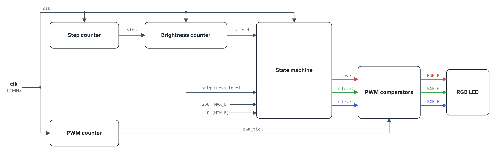
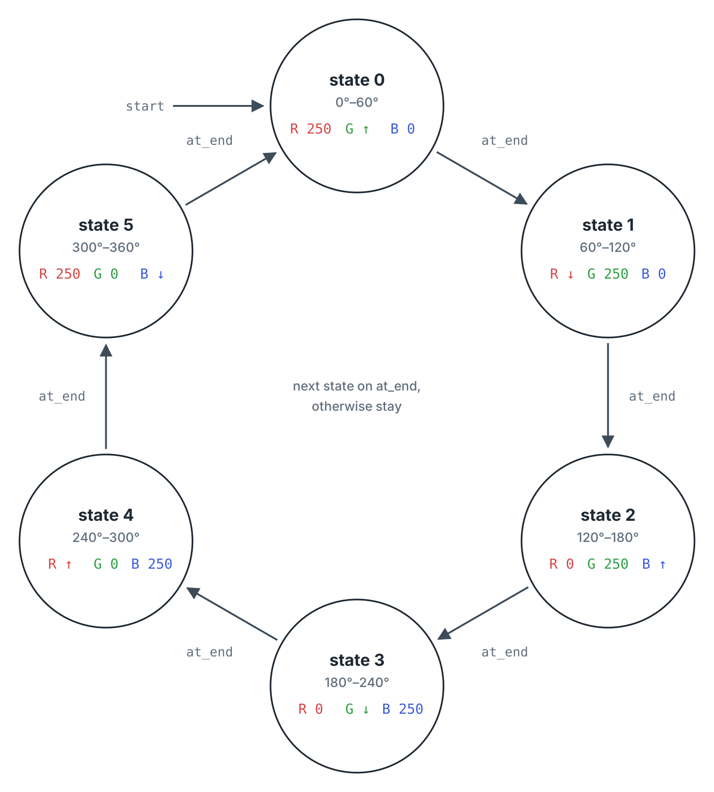
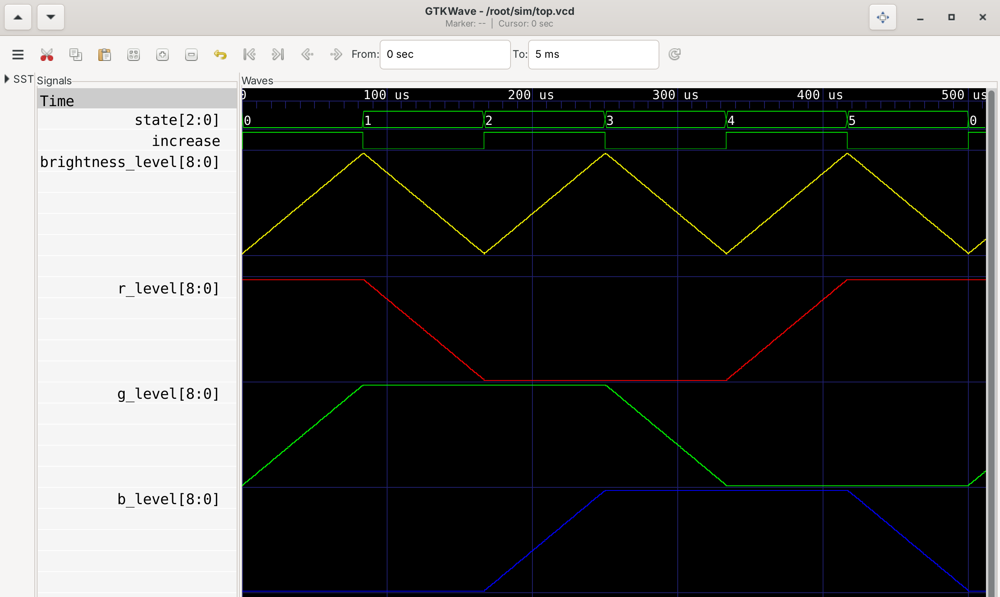
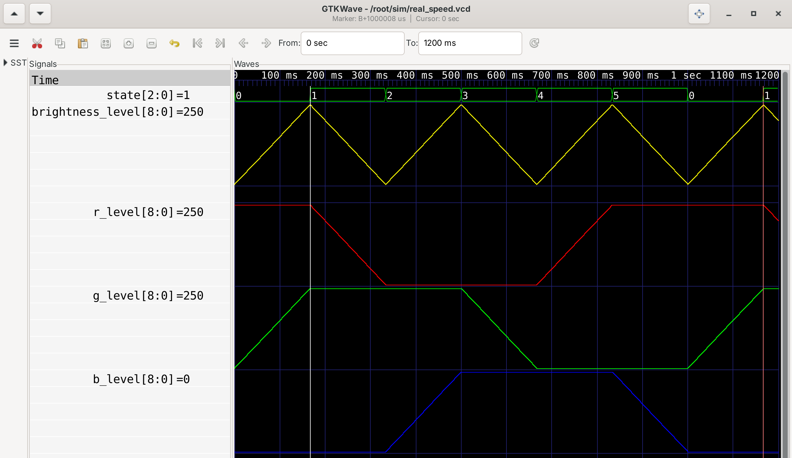
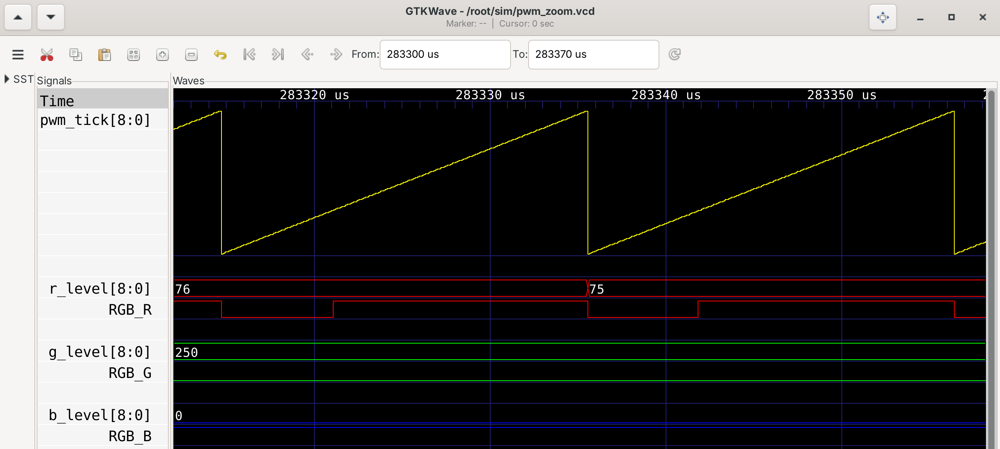

# ENGR 3410 Miniproject 2: HSV Color Cycle on the iceBlinkPico

Dhvan Shah

Source code and test benches: https://github.com/Dh-Van/eclectronics-mp2

Video demos:

- Several full color cycles next to a stopwatch, to show each cycle takes one second: https://drive.google.com/file/d/1aq6VPDQZTusRbJdS3GG5lY70SdrcggGV/view?usp=sharing
- The LED right after the board is programmed, to show which color the cycle starts on: https://drive.google.com/file/d/1uGaLQykTzgob2KMyBVAATN2kWslTLwWv/view?usp=sharing

## Overview

This design drives the RGB LED on the iceBlinkPico so it fades all the way around the HSV color wheel once per second. Each color channel is driven with PWM, and the brightness of each channel follows the R, G, B vs. hue graph from the assignment, shown in Figure 1.



*Figure 1. R, G, B duty cycle vs. hue angle, from the assignment.*

The design is built around one pattern in that graph. In every 60° slice of hue, exactly one color is ramping and the other two are stuck at either 0% or 100%. The ramps also alternate: up from 0° to 60°, down from 60° to 120°, up again, and so on. So one triangle wave can supply every ramp in the cycle. My circuit makes a single triangle wave and uses a 6-state state machine to decide which color gets the triangle and which colors sit at 0% or 100%.

## Architecture

Everything lives in one SystemVerilog module, `top.sv`, but it breaks down into five blocks that each do one job. Figure 2 shows how they connect. The four blocks on the clock line hold registers that update on each clock edge. The comparators are plain logic with no clock, so their outputs change as soon as their inputs do.



*Figure 2. Block diagram of `top.sv`. Wire labels are the signal names in the code. `clk` is the module's only input, and `RGB_R`, `RGB_G` and `RGB_B` are its outputs.*

The PWM counter, `pwm_tick`, counts from 0 to 249 on every edge of the 12 MHz clock and then wraps back to 0. One trip through is one PWM period: 250 clocks, or about 20.8 µs (48 kHz). That is fast enough that the LED doesn't visibly flicker.

The step counter, `step_tick`, counts from 0 to 7999. Each time it reaches 7999, the brightness counter is allowed to move by one. This counter sets how fast the colors change.

The brightness counter, `brightness_level`, is the triangle wave. On each step it goes up by 1 until it hits 250, then turns around and goes down to 0, then back up again. A one-bit register called `increase` remembers which direction it's going. The signal `at_end` goes high for one clock when `brightness_level` reaches the end it was heading toward (250 going up, 0 going down), and on that clock `increase` flips.

The state machine has two parts. A 3-bit register, `state`, counts 0 through 5 and then goes back to 0. It moves forward each time `at_end` fires, so each state lasts exactly one ramp, which is 60° of hue. An `always_comb` case statement then looks at `state` and gives each color a level: 250 (full on), 0 (off), or `brightness_level` (the ramp). Figure 3 shows the state diagram, and Table 2 lists the same thing as a table.



*Figure 3. State diagram. Each state shows its hue range and what each color gets: 250 (full on), 0 (off), ↑ (follows `brightness_level` while it counts up), or ↓ (follows it while it counts down).*

The comparators are the last step. Each output is just `pwm_tick < level`, inverted. If a color's level is 75, the comparison is true for 75 of the 250 counts, so that LED is on for 30% of each period. A level of 250 gives 100% because `pwm_tick` never gets past 249. The output gets inverted because the LED pins on this board are active low, meaning a 0 on the pin turns the LED on.

The counter limits were chosen so one full cycle comes out to exactly one second:

| Quantity | Value |
|---|---|
| Clock | 12 MHz |
| PWM period | 250 clocks = 20.8 µs (48 kHz) |
| Brightness step | every 8000 clocks = 0.667 ms |
| One ramp (one state, 60° of hue) | 250 steps × 8000 clocks = 2,000,000 clocks = 166.7 ms |
| Full cycle (6 states, 360°) | 12,000,000 clocks = 1.000 s |

*Table 1. Timing.*

| `state` | Hue | R level | G level | B level | Ramp direction |
|---|---|---|---|---|---|
| 0 | 0° to 60° | 250 | ramp | 0 | up |
| 1 | 60° to 120° | ramp | 250 | 0 | down |
| 2 | 120° to 180° | 0 | 250 | ramp | up |
| 3 | 180° to 240° | 0 | ramp | 250 | down |
| 4 | 240° to 300° | ramp | 0 | 250 | up |
| 5 | 300° to 360° | 250 | 0 | ramp | down |

*Table 2. What the state machine outputs in each state.*

Even states always need a ramp going up and odd states always need one going down. The triangle wave turns around at the same moment the state changes, so the direction is always right for whichever color is ramping. This is why one shared ramp is enough for all three colors.

## Simulation

The test bench, `top_tb.sv`, makes a 12 MHz clock and runs the design in Icarus Verilog. Simulating a full second at 12 MHz means 12 million clock cycles, and dumping every signal for that long makes a huge VCD file, so this test bench overrides `STEP_INTERVAL` to 4 instead of 8000. Each ramp then takes 1000 clocks (83.3 µs) and a full color cycle takes 500 µs, so the 5 ms run covers ten full cycles. Nothing else changes, so the waveforms have the same shape as on the real board, just 2000 times faster.



*Figure 4. One full color cycle from `top_tb.sv` in GTKWave (0 to 510 µs, sped up 2000×). Levels are shown in analog format.*

In Figure 4, the top two rows are `state` and `increase`. You can see `state` step from 0 to 5 and `increase` flip every time the triangle turns around. The yellow trace is `brightness_level`, the shared triangle wave. The red, green, and blue traces are `r_level`, `g_level`, and `b_level`, the duty cycles going into the comparators (250 means 100%). Each one copies the triangle while its color is ramping and stays flat at 0 or 250 otherwise, which matches Figure 1.

Speeding things up is good for checking the shapes, but it doesn't show that the real design takes one second. For that, a second test bench, `real_speed_tb.sv`, runs `top` with the real `STEP_INTERVAL` of 8000 for 1.2 s of sim time (14.4 million clocks). It dumps every signal, so the VCD ends up over 1 GB and the run takes about a minute, which is fine for a one-time check. It also counts clock cycles and prints a timestamp every time `state` goes from 0 to 1. The gap between two of those is one full trip around the color wheel. Here is the simulation output:

```
state 0->1 at t = 166.668125 ms, clk = 2000001
state 0->1 at t = 1166.676125 ms, clk = 14000001
one full cycle = 12000000 clocks = 1.000000 s
```

One cycle is exactly 12,000,000 clocks, which is 1 second at 12 MHz.



*Figure 5. Real-speed run from `real_speed_tb.sv` in GTKWave (0 to 1.2 s). The two markers sit on consecutive state 0-to-1 changes.*

Figure 5 shows the same run in GTKWave. The baseline marker is on the first 0-to-1 change and the main marker is on the second, and GTKWave prints the gap between them in the title bar as `B+1000008 us`. The extra 8 µs comes from the test bench, not the design. The clock toggles every 41.667 ns, so the simulated clock period is 83.334 ns instead of 83.333 ns, and over 12 million cycles that adds up to 8 µs. Counting clock cycles gets around that rounding.

At the zoom level of Figures 4 and 5, the PWM outputs switch far too fast to see. To show the PWM signals themselves, a third short test bench, `pwm_zoom_tb.sv`, runs the design with the real `STEP_INTERVAL` of 8000 so the duty cycle holds still for several PWM periods. It only records a 70 µs window starting at 283.3 ms, which falls in state 1 (red fading out, green full on, blue off).



*Figure 6. PWM outputs at real speed from `pwm_zoom_tb.sv`, about two PWM periods. The RGB outputs are active low.*

In Figure 6, the yellow sawtooth is `pwm_tick`. It climbs from 0 to 249 and drops back to 0 every 20.8 µs, and each drop starts a new PWM period. Below it, each color has two rows: its level and its output pin.

Start with red. `r_level` is 76, then drops to 75 partway through the window. At the start of each period, `pwm_tick` is still below that level, so `RGB_R` is low and the red LED is on. About 30% of the way up the sawtooth, `pwm_tick` passes the level, `RGB_R` goes high, and red stays off until the next reset. That gives the short low pulse right after each reset in the `RGB_R` row.

Green and blue sit at the two extremes. `g_level` is 250, which `pwm_tick` never reaches, so `RGB_G` stays low and green is on 100% of the time. `b_level` is 0, so `RGB_B` stays high and blue is off. All three outputs look upside down compared to their duty cycles because the LED is active low.

## Building and running

The Makefile handles the whole flow. `make` synthesizes with Yosys, places and routes with nextpnr, and packs the bitstream with icepack. `make prog` flashes the board with dfu-util. `make sim` runs the test bench and `make wave` opens the result in GTKWave. The two extra test benches run the same way by hand, for example `iverilog -g2012 -o build/rs.out real_speed_tb.sv` followed by `vvp build/rs.out`. The real-speed one takes about a minute and writes a VCD over 1 GB.

Files in the repo:

- `top.sv`: the full design
- `top_tb.sv`: test bench for Figure 4 (sped-up step interval)
- `real_speed_tb.sv`: test bench for Figure 5 (real timing, measures one full cycle)
- `pwm_zoom_tb.sv`: test bench for Figure 6 (real timing, short window)
- `iceBlinkPico.pcf`: pin assignments (clock on pin 20, RGB LED on pins 39 to 41)
- `Makefile`: build, flash, and simulation targets
